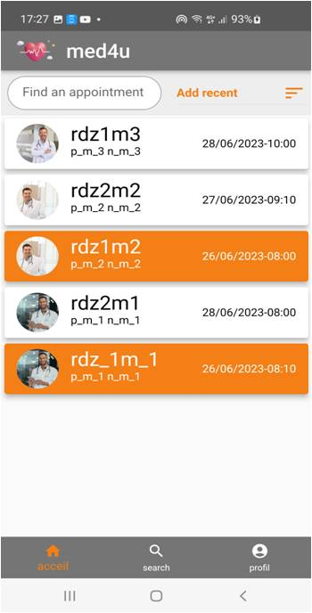

# Med4U

Med4U est une application mobile dédiée à la gestion des rendez-vous médicaux, offrant aux patients un moyen simple et rapide de trouver des médecins et de gérer leurs consultations. Conçue avec Flutter et intégrée à Firebase, elle permet d'assurer une connexion en temps réel et une gestion fluide des données de santé.

## Fonctionnalités principales :
- **Prise de rendez-vous** : Réservez facilement des consultations médicales selon vos disponibilités.
- **Gestion des médecins** : Parcourez une liste de praticiens disponibles, classés par spécialité.
- **Notifications en temps réel** : Recevez des rappels automatiques pour vos prochains rendez-vous.
- **Historique des consultations** : Consultez l’historique de vos consultations passées avec des détails complets.
- **Intégration avec Firebase** : Assurez la sécurité et la confidentialité de vos données médicales via la base de données en temps réel Firebase.

## Captures d'écran

